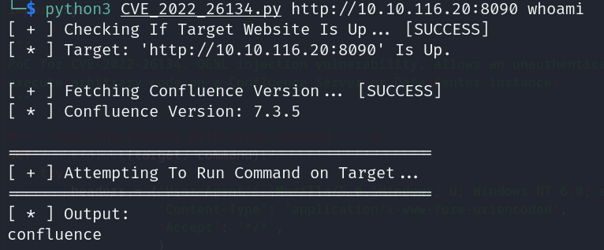
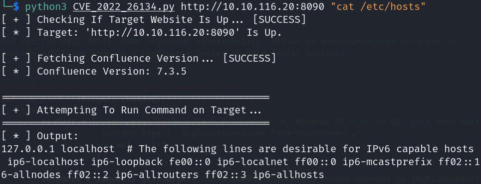

# CVE-2022-26134 PoC

> [!WARNING]
> LEGAL DISCLAIMER:
> This tool is STRICTLY for EDUCATIONAL PURPOSES ONLY!
> Usage of this tool for attacking targets without prior mutual consent is ILLEGAL.
> It is the user's responsibility to obey all laws that apply whilst using this tool.
> The developer of this tool assumes no liability and is not responsible for any misuse
> or damage caused by this program.

## About The CVE:
In affected versions of Confluence Server and Data Center, an OGNL injection vulnerability exists that allows an unauthenticated attacker to execute arbitrary code on a Confluence Server or Data Center instance.

### Affected Versions:
- 1.3.0 -> 7.4.17
- 7.13.0 -> 7.13.7
- 7.14.0 -> 7.14.3 
- 7.15.0 -> 7.15.2 
- 7.16.0 -> 7.16.4
- 7.17.0 -> 7.17.4
- 7.18.0 -> 7.18.1 

## Installing and Using The PoC:
- First, run the command **git clone https://github.com/acfirthh/CVE-2022-26134.git**
- Change directory into where you downloaded the PoC: **cd CVE-2022-26134**
- Finally, run the command **python3 CVE_2022_26134.py <TARGET> <COMMAND>**

If the command you want to run has spaces in it, you must put the command in quotes ("" or ''):

## Learn More About This CVE and How This PoC Works:
There is a TryHackMe room dedicated to this CVE, named 'Atlassian CVE-2022-26134', here is the link
to the room: [https://tryhackme.com/room/cve202226134](https://tryhackme.com/room/cve202226134)

Furthermore, here is the NIST writeup for CVE-2022-26134: [https://nvd.nist.gov/vuln/detail/CVE-2022-26134](https://nvd.nist.gov/vuln/detail/CVE-2022-26134)
